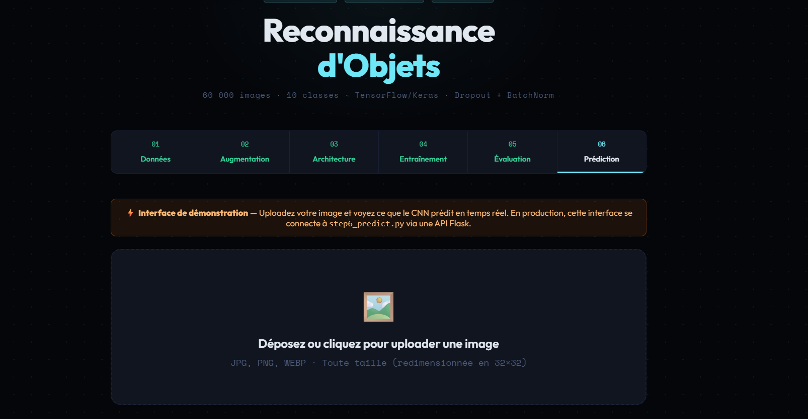

# 🧠 CIFAR-10 Object Recognition with Deep CNN

This project implements a **Deep Convolutional Neural Network (CNN)** to classify images from the **CIFAR-10 dataset** into 10 object categories.

The repository demonstrates a **complete deep-learning pipeline**, including:

* Data exploration
* Data augmentation
* CNN model design
* Model training
* Model evaluation
* Image prediction via CLI
* A **Flask web interface** for real-time predictions

Dataset: **CIFAR-10 (60,000 images, 10 classes, 32×32 RGB)**

---

# 📁 Project Structure

```
cifar10_cnn/
├── step1_data.py          # Step 1: Data loading & exploration
├── step2_augmentation.py  # Step 2: Data augmentation
├── step3_model.py         # Step 3: CNN architecture
├── step4_train.py         # Step 4: Model training
├── step5_evaluate.py      # Step 5: Evaluation & visualizations
├── step6_predict.py       # Step 6: CLI image prediction
├── app.py                 # Flask server (API + Web interface)
├── app_ui.html            # Web interface
├── requirements.txt
└── outputs/
    ├── best_model.keras
    ├── final_model.keras
    ├── training_curves.png
    ├── confusion_matrix.png
    ├── cifar10_samples.png
    └── ...
```

---

# ⚙️ Installation

Clone the repository and install the dependencies.

```bash
git clone https://github.com/yourusername/cifar10_cnn.git
cd cifar10_cnn
pip install -r requirements.txt
```

---

# 🚀 Step-by-Step Execution

## Step 1 — Data Exploration

Load the CIFAR-10 dataset and visualize samples.

```bash
python step1_data.py
```

Outputs:

* `outputs/cifar10_samples.png`
* `outputs/class_distribution.png`

---

## Step 2 — Data Augmentation

Generate augmented versions of training images.

```bash
python step2_augmentation.py
```

Outputs:

* `outputs/augmentation_examples.png`

---

## Step 3 — CNN Model Architecture

Build the convolutional neural network.

```bash
python step3_model.py
```

Outputs:

* Model summary in the console
* `outputs/model_architecture.png`

Approximate parameters: **~1.2 million**

---

## Step 4 — Model Training

Train the CNN model.

```bash
python step4_train.py
```

Training time:

* CPU → ~5–10 minutes per epoch
* GPU → ~30–60 seconds per epoch

Outputs:

* `outputs/best_model.keras`
* `outputs/final_model.keras`
* `outputs/training_curves.png`

---

## Step 5 — Model Evaluation

Evaluate the trained model on the test dataset.

```bash
python step5_evaluate.py
```

Outputs:

* Test accuracy
* Classification report
* `outputs/confusion_matrix.png`
* `outputs/per_class_accuracy.png`
* `outputs/wrong_predictions.png`

---

## Step 6 — Image Prediction (CLI)

Predict the class of a custom image.

```bash
python step6_predict.py --image my_image.jpg
```

Top-3 predictions:

```bash
python step6_predict.py --image my_image.jpg --top 3
```

Outputs:

* Prediction results in the console
* `outputs/prediction_result.png`

---

# 🌐 Web Interface

The project includes a **Flask web interface** that allows users to upload an image and receive predictions instantly.

Run the server:

```bash
pip install flask flask-cors
python app.py
```

Open in your browser:

```
http://localhost:5000
```

The interface allows:

* Image upload
* Real-time prediction
* Display of class probabilities

---

# 📷 Interface Preview

Add screenshots of the interface here.

Example:

```
screenshots/interface.png
screenshots/DEMO.png
```

Markdown example:

```



```

---

# 📊 Expected Results

| Metric           | Value        |
| ---------------- | ------------ |
| Test Accuracy    | 82 – 88 %    |
| Test Loss        | 0.45 – 0.60  |
| Total Parameters | ~1.2 million |
| Training Epochs  | 50 – 80      |

---

# 🧩 CNN Architecture

```
Input (32×32×3)
↓
[Conv2D(32) → BN → ReLU] ×2 → MaxPool → Dropout(0.25)
↓
[Conv2D(64) → BN → ReLU] ×2 → MaxPool → Dropout(0.35)
↓
[Conv2D(128) → BN → ReLU] ×2 → MaxPool → Dropout(0.45)
↓
Flatten → Dense(256) → BN → ReLU → Dropout(0.5)
↓
Dense(10) → Softmax
```

---

# 🏷️ CIFAR-10 Classes

```
airplane
automobile
bird
cat
deer
dog
frog
horse
ship
truck
```

---

# 📚 Technologies Used

* Python
* TensorFlow / Keras
* NumPy
* Matplotlib
* Flask

---

# 📌 Project Goal

The goal of this project is to demonstrate the **complete workflow of building a deep learning image classification system**, from dataset exploration to deployment through a simple web interface.

This project can be used for **learning, experimentation, or as a portfolio deep-learning project**.
